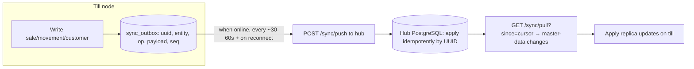
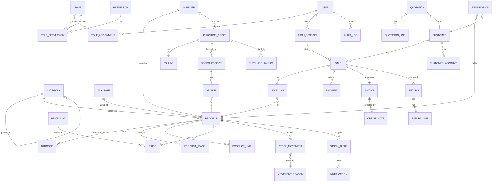
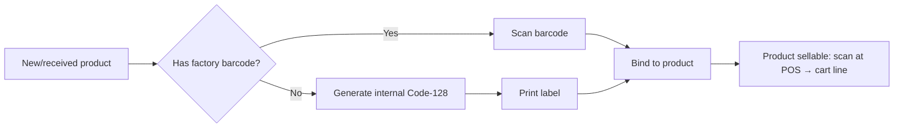
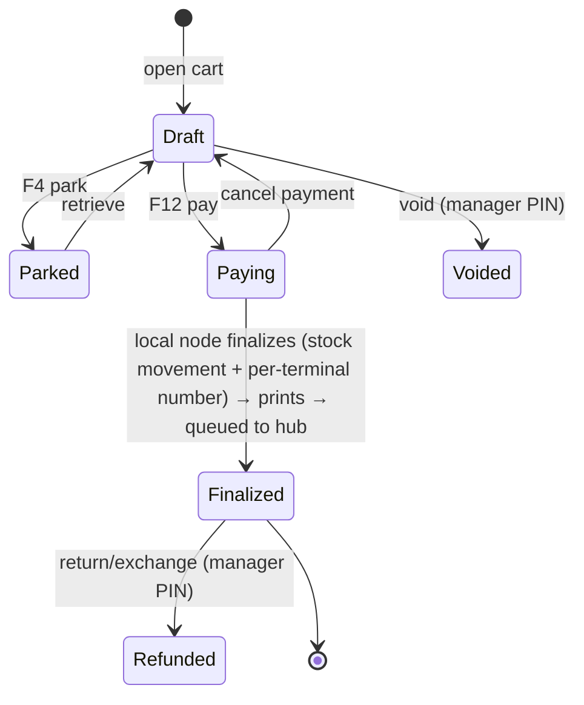

# Teyssir Library — Management Platform

**Architecture & Design Specification**
Version 0.4 · 2026-06-21 · Author: Architecture team
Status: **All decisions locked — ready to scaffold.** Stack (Django + React PWA), Tunisia/TND
(store 3-dp / display 2-dp), Telegram, management accounting, **full offline operation**,
configurable `fiscal_stamp_fee` (snapshotted per invoice), **per-terminal + per-month atomic
numbering `C1-YYYYMM-XXXX`** (proceeding; hub pre-allocated blocks held as DGI fallback), **3 tills
(`C1`/`C2`/`C3`) + 1 dedicated hub PC "Teyssir Hub"**, canonical brand **"Teyssir"** — all confirmed.

> This document deliberately *challenges* the brief where the brief is internally
> inconsistent (e.g. "use only free tools" vs. "WhatsApp Business API", or four
> candidate stacks none of which match the maintainer's actual expertise). Each
> challenge is flagged with **⚠ CHALLENGE** so you can accept or overrule it.

---

## Table of contents (maps 1:1 to your 22 deliverables)

| # | Deliverable | Section |
|---|-------------|---------|
| 1 | Critical analysis of requirements | [§1](#1-critical-analysis-of-requirements) |
| 2 | Missing requirements | [§2](#2-missing-requirements) |
| 3 | Risk analysis | [§3](#3-risk-analysis) |
| 4 | Recommended architecture | [§4](#4-recommended-architecture) |
| 5 | Technology stack selection | [§5](#5-technology-stack-selection) |
| 6 | Infrastructure architecture diagram | [§6](#6-infrastructure-architecture) |
| 7 | Database architecture | [§7](#7-database-architecture) |
| 8 | ERD diagram | [§8](#8-erd) |
| 9 | Module decomposition | [§9](#9-module-decomposition) |
| 10 | User roles & permissions | [§10](#10-user-roles--permissions-rbac) |
| 11 | UI/UX design specification | [§11](#11-uiux-design-specification) |
| 12 | Barcode integration design | [§12](#12-barcode-integration-design) |
| 13 | POS design | [§13](#13-pos-design) |
| 14 | Inventory management design | [§14](#14-inventory-management-design) |
| 15 | Accounting & reporting design | [§15](#15-accounting--reporting-design) |
| 16 | WhatsApp / notification design | [§16](#16-notification--whatsapp-design) |
| 17 | Backup & recovery design | [§17](#17-backup--recovery-design) |
| 18 | Security architecture | [§18](#18-security-architecture) |
| 19 | Testing strategy | [§19](#19-testing-strategy) |
| 20 | Deployment guide | [§20](#20-deployment-guide) |
| 21 | Maintenance guide | [§21](#21-maintenance-guide) |
| 22 | Future evolution roadmap | [§22](#22-future-evolution-roadmap) |

---

## Executive summary — the locked decisions

1. **Topology: federated offline-capable nodes + a back-office hub (CONFIRMED: full offline).**
   The owner requires **full offline operation** — each till must *finalize* sales while the
   network or hub is down, not merely buffer the cart. So every till runs its own local app +
   local database (full POS works disconnected) and **syncs** to a back-office **hub** (the
   consolidated PostgreSQL source of truth) when connectivity returns. The three invariants that
   make multi-node sync *correct* (see §4.4): (a) **master data is single-writer** (only the hub
   edits products/prices) → no catalog conflicts; (b) **each terminal issues invoices in its own
   gapless series** → no numbering conflicts; (c) **stock is an append-only movement ledger** →
   sync is a commutative union, oversell is *detected & flagged* on merge, never a hard conflict.

2. **Stack: Django + DRF + PostgreSQL (hub) / SQLite (tills) + React PWA. CONFIRMED.**
   Chosen over the four proposed .NET/Electron options because the maintainer is Django-fluent —
   the dominant maintainability variable for a 10-year product. 100% free/OSS. Business logic
   lives **once** in Python and runs on every node (no JS reimplementation of money/tax math).

3. **Database: PostgreSQL at the hub, SQLite per till.** These are *not* in tension: SQLite is a
   poor *shared networked* DB but an excellent *local single-process* DB — exactly a till's
   profile (one app instance, fully offline). The hub consolidates everything in PostgreSQL for
   reporting, accounting, master-data authoring, and backups. (SQL Server Express = proprietary +
   10 GB cap; MariaDB = fine but loses to PG on constraints/Django fit.)

4. **Notifications: Telegram Bot API primary. CONFIRMED.** Truly free, instant, 30 min to wire.
   WhatsApp Cloud API (official) stays an optional secondary. **Hard rule: never use unofficial
   WhatsApp libraries (whatsapp-web.js / Baileys)** — ToS violation that gets the number banned.

5. **Money: TND, stored scale 3 (millimes), displayed 2 decimals. CONFIRMED.** A 0.850 DT pen needs
   the millime, so we **store** `Decimal(14,3)` (lossless) and **display/round** to 2 decimals in
   UI/receipts, `ROUND_HALF_UP`, never `float`. Invoices carry `matricule fiscal`, TVA (**7%** on
   books/manuals/newspapers/fournitures scolaires, 13%, 19%, 0%/exonéré), and a **configurable
   `fiscal_stamp_fee`** (admin-editable, default **1.000 DT**, override per invoice type), whose
   resolved value is **snapshotted onto each invoice** as `timbre_amount_snapshot` (immutability).
   Document numbers use a **per-terminal + per-month atomic series** (e.g. `C1-202606-0001`).

7. **One hub PC is MANDATORY — "Teyssir Hub" (PC-1). CONFIRMED.** It is simultaneously the
   PostgreSQL server, the **sync master**, the **backup node**, and the **reporting engine**. Tills
   are offline-capable nodes that depend on the hub only for consolidation, not for selling.

6. **Accounting scope: management reports + accountant export. CONFIRMED.** No in-app
   double-entry general ledger in V1 (it stays a Phase-5 option / handled by the accountant).

---

## 1. Critical analysis of requirements

### 1.1 What the brief gets right
- Clear domain (retail library/stationery), clear scale (1 store, 3–4 PCs), clear non-functionals
  (bilingual AR/FR, offline tolerance, barcode, thermal printing, backups, security).
- Correctly identifies the four pillars: **Inventory · POS · Purchasing · Accounting**.

### 1.2 Internal contradictions & over-specifications (challenged)

| Brief says | Problem | Resolution |
|---|---|---|
| "Offline-first" with stock/number consistency | Naïve multi-master offline causes oversell & duplicate invoice numbers across tills | **RESOLVED via 3 invariants** (single-writer master data, per-terminal gapless series, append-only stock ledger) → full offline is correct (§4.4) |
| "WhatsApp Business API" **and** "free tools only" | WA Business/Cloud API isn't unconditionally free; needs Meta BSP setup | **Telegram primary** (free), WA Cloud API free-tier optional (§16) — CONFIRMED |
| "Card payments" | A small TN library does **not** integrate a payment gateway; cards run on a standalone bank TPE terminal | POS **records** tender type "card" + TPE ref; no in-app card processing (§13.4) |
| 4 candidate stacks, all .NET/Node | Ignores maintainer's Django fluency; raises bus-factor risk | **Django stack CONFIRMED** (§5) |
| ".NET MAUI / Electron desktop" | A native binary per PC = painful packaging | **PWA** frontend (no native packaging); local Django app per till updated by one scripted release (§20) |
| "Distributed databases" | Now *required* by full-offline | **Federated**: SQLite per till + hub PostgreSQL, reconciled by sync (§4.4, §7) |

### 1.3 Domain realities the brief under-weights
- **Currency precision:** TND = 3 decimals (millimes). `19.500 TND`, `0.250 TND`. Rounding must be
  defined explicitly (round half-up to the millime). `float` money = silent cent/millime drift.
- **Books are special products:** identified by **ISBN-13** (which *is* an EAN-13 barcode),
  often VAT-reduced or exempt, frequently sold on **credit accounts to schools**.
- **Products without a manufacturer barcode** (loose pens, local notebooks) need **internally
  generated barcodes + label printing**.
- **Fiscal/legal (Tunisia):** facture must carry seller `matricule fiscal`, sequential **gapless**
  invoice numbers, TVA breakdown, `timbre fiscal` (~1.000 TND), and accounting records must be
  retained **10 years**. Invoices are **immutable** — you correct with a credit note (avoir),
  never by editing/deleting.
- **Cash control:** cashiers need **shift sessions** with opening float and **X/Z reports**
  (mid-shift read / end-of-day close) for cash reconciliation — this is the #1 anti-theft control.
- **Units & price tiers:** a copybook sells by piece *and* by pack/dozen; schools buy at
  wholesale, walk-ins at retail → **multi-unit** + **price lists**.

---

## 2. Missing requirements (must be added before build)

**Financial / fiscal**
- M1. Currency = TND; **store** scale 3 (millimes), **display** 2 decimals; rounding HALF_UP. A
  `Money` value object centralizes all arithmetic; `float` is banned.
- M2. Configurable tax rates per product. **Tunisia defaults:** 7% (books, manuels scolaires,
  journaux, fournitures scolaires — the bulk of the catalog), 13%, 19% (e.g. electronic
  accessories, some toys/games), 0%/exonéré.
- M2b. **Configurable `fiscal_stamp_fee`** in admin settings: default **1.000 DT**, editable, with
  **per-invoice-type override** (e.g. facture = apply, ticket de caisse = none, avoir = per policy).
  The resolved value is **snapshotted** onto each issued invoice (`invoice.timbre_amount_snapshot`)
  so historical documents never change when the setting is later edited.
- M3. Gapless, immutable, per-year invoice number sequences; credit-note (avoir) flow.
- M4. Seller fiscal identity (matricule fiscal, RNE, address) in settings; printed on invoices.
- M5. 10-year retention + yearly fiscal archive/close.

**Operational**
- M6. Cash session lifecycle (open float → sales → X read → Z close → variance).
- M7. Multi-unit of measure + unit conversion (piece/pack/dozen/ream).
- M8. Price lists / tiers (retail, wholesale/school) + per-customer pricing.
- M9. Customer **credit accounts** (sell on account, statements, ageing, payments-on-account).
- M10. Return/exchange policy engine (time window, condition, with/without receipt).
- M11. Internal barcode generation + label-printing for unbarcoded goods.
- M12. Stock-take / physical inventory count workflow with variance posting.
- M13. Receipt reprint + duplicate-marking; quotation→sale and reservation→sale conversions.

**Platform / non-functional**
- M14. Hardware bridge for ESC/POS printer, label printer, cash-drawer kick, scanner.
- M15. Power-loss resilience (UPS on server + router) and clean DB recovery.
- M16. Image storage strategy (where product photos live, size limits, backups include them).
- M17. SKU scale target (assume 10k–20k SKUs) and search performance budget.
- M18. Audit trail (who/what/when) on all financial + stock + permission changes.
- M19. Backups must include DB **and** uploaded images **and** config.
- M20. Time source / NTP (correct timestamps for fiscal + audit; offline clock drift).
- M21. License/activation model **only if** sold to other stores (§22); not for own store.

---

## 3. Risk analysis

| ID | Risk | Likelihood | Impact | Mitigation |
|----|------|-----------|--------|------------|
| R1 | Server PC hardware failure (single point of failure) | Med | **Critical** | UPS; nightly + hourly backups (§17); **warm-standby** restore runbook ≤30 min RTO; spare PC imaged |
| R2 | WiFi drop mid-sale | High | High | **Ethernet** the till PCs; WiFi for handhelds only; POS buffers in-flight cart locally (§4.3) |
| R3 | Concurrent oversell (2 tills sell last unit) | Med | High | Server-authoritative stock; DB transaction + `SELECT … FOR UPDATE` row lock on stock decrement (§7.4) |
| R4 | TND rounding drift | High if unmanaged | High (fiscal) | Integer millimes / `Decimal(12,3)`, HALF_UP, money value object, property-test (§19) |
| R5 | WhatsApp number ban (unofficial lib) | High if used | **Critical** | **Forbid** unofficial libs; use Telegram / official Cloud API (§16) |
| R6 | Data loss (no tested restore) | Med | **Critical** | 3-2-1 backups + **monthly restore drill**; backups encrypted off-site (§17) |
| R7 | Theft / cash skimming | Med | High | Cash sessions + Z reports; immutable audit log; void/refund require manager PIN (§13, §18) |
| R8 | Bus factor (exotic stack) | — | High | Build in **Django** (maintainer-fluent); document everything (§5) |
| R9 | RTL/i18n defects | Med | Med | Logical-CSS + RTL test matrix; native AR/FR review (§11, §19) |
| R10 | Power outage corrupts DB | Med | High | UPS + PostgreSQL fsync/WAL (default safe); graceful shutdown hook |
| R11 | Insider data theft (export of customer/financial data) | Low | High | RBAC least-privilege, audit exports, disk encryption (BitLocker) (§18) |
| R12 | Update breaks production at the store | Med | High | Staging restore-test before update; one-command rollback; migrations reversible (§20–21) |

---

## 4. Recommended architecture

### 4.1 Style
**Modular monolith, deployed as federated instances.** The codebase is one Django project
(app-per-domain, service layer) — *not* microservices, which is the right altitude for a single
store. But because the owner requires **full offline operation**, the *same* monolith is deployed
as multiple cooperating instances: one **hub** at the back office and one **node** per till. Each
node runs the full POS path against a **local** database, so it keeps selling when the hub or WiFi
is down. A **sync engine** reconciles nodes with the hub when connectivity returns (§4.4).
Business logic (money, tax, numbering, stock) lives **once** in Python and executes on every
node — there is no second implementation in JavaScript to drift out of sync.

### 4.2 Deployment topology (federated, full-offline)
```
        ┌─────────────────────────── BACK-OFFICE HUB (1 PC, UPS) ───────────────────────────┐
        │  Django+DRF (master-data authoring, purchasing, accounting, consolidated reports)  │
        │  PostgreSQL 16 = source of truth · Redis · Celery · Caddy(TLS) · Channels          │
        │  Backups (3-2-1) · Sync server endpoint · Telegram notifier                        │
        └───────▲───────────────────────────▲───────────────────────────▲───────────────────┘
                │ sync (pull master data,    │ sync                       │ sync
                │  push transactions)         │                            │
   ┌────────────┴───────────┐   ┌─────────────┴──────────┐   ┌─────────────┴──────────┐
   │  TILL NODE 1           │   │  TILL NODE 2           │   │  TILL NODE 3 (or phone) │
   │  Django+DRF (local)    │   │  Django+DRF (local)    │   │  Django+DRF (local)     │
   │  SQLite (local truth)  │   │  SQLite (local truth)  │   │  SQLite (local truth)   │
   │  React PWA → localhost  │   │  React PWA → localhost  │   │  React PWA → localhost  │
   │  Hardware bridge:      │   │  Hardware bridge:      │   │  scanner (HID)          │
   │  ESC/POS, drawer, label │   │  ESC/POS, drawer, label │   │                         │
   │  Invoice series  "C1"  │   │  Invoice series  "C2"  │   │  Invoice series  "C3"   │
   └────────────────────────┘   └────────────────────────┘   └─────────────────────────┘
   Sells fully offline; syncs   Sells fully offline; syncs    Sells fully offline; syncs
```
Each till's PWA talks to **its own localhost Django** — so "the server is down" never blocks a
sale; the till *is* a server. The hub is reached only by the sync engine, asynchronously.

**The hub is mandatory — one PC, "Teyssir Hub" (PC-1).** It plays four roles at once: (1)
**PostgreSQL server** (consolidated source of truth), (2) **sync master** (every till
pushes/pulls here), (3) **backup node** (3-2-1, all nodes' data lands here), (4) **reporting
engine** (dashboards + accounting run on the consolidated DB). In production it is **dedicated**
to those four roles and does **not** act as a till. **Confirmed:** `PC-1 = "Teyssir Hub"`, on UPS,
wired Ethernet, static DHCP reservation `teyssir-hub.local`. Launch fleet = **3 tills** (`C1`,
`C2`, `C3`) + the dedicated hub.

### 4.3 The five architecture questions — decided (for full offline)

| Question | Decision | Why |
|---|---|---|
| Thick vs thin client | **PWA front-end over a *local* Django node** | Thin UI, but a real local server per till = true offline + single-language logic |
| Desktop vs web | **Web (PWA), installable per till** | Mature AR/FR + RTL; no native packaging; localhost backend works offline |
| Local vs distributed server | **Distributed: 1 node per till + 1 hub** | Required by full-offline; hub consolidates |
| Offline-first vs online-first | **Offline-first (full)** | Owner requirement; tills finalize sales disconnected |
| Central vs distributed DB | **Distributed: SQLite per till, PostgreSQL hub** | Local truth for offline; hub = consolidated truth |

**Trade-off owned explicitly:** full offline buys resilience at the cost of (a) N app instances to
update instead of one (mitigated: identical codebase, one scripted release — §20), and (b) a sync
engine + eventual consistency (the hub view of a disconnected till is stale until it reconnects).
We accept both because the owner ranks "never stop selling" above operational simplicity.

### 4.4 Sync & conflict model (the heart of full-offline correctness)

Sync is made *correct and boring* by three invariants that remove every real merge conflict:

1. **Master data is single-writer (hub-authoritative).** Only the hub creates/edits products,
   prices, categories, tax rates, suppliers. Tills hold a **read replica**, refreshed on each
   sync (last-write-wins by hub version — and since tills never edit it, there is no true
   conflict). *Exception:* a till may quick-create a walk-in **customer**; these flow up and are
   de-duplicated by UUID + phone.

2. **Per-terminal + per-month gapless series, allocated by atomic increment.** Each document number
   is `{terminal}-{YYYYMM}-{XXXX}` (e.g. `C1-202606-0001`); `seq` **resets to 1 each month per
   terminal**. The next `seq` comes from an **atomic** local counter row keyed by
   `(terminal, year, month)` — `UPDATE numbering SET seq = seq + 1 WHERE … RETURNING seq` inside the
   sale transaction (SQLite `RETURNING` / Postgres `FOR UPDATE`). This stays gapless within each
   `(terminal, month)` even fully offline, needs no hub round-trip, and never collides across tills.
   The hub stores all series and aggregates for reporting. ⚠ **Fiscal validation required:** confirm
   the format **and the monthly reset** with the accountant/DGI before go-live (per-POS, monthly-reset
   series are common in TN; get explicit sign-off). If a single global series is mandated instead, the
   hub pre-allocates number blocks per terminal.

3. **Stock is an append-only movement ledger (CRDT-like).** A sale writes `stock_movement`
   rows (negative qty) locally. Sync = **union** of all nodes' movements (idempotent by UUID).
   `qty_on_hand` is a *fold* over movements, recomputed at the hub — so concurrent offline sales
   never "conflict"; they just sum. If two tills each sold the last unit while offline, the merged
   on-hand goes **negative**, which surfaces as a **reconciliation exception** for the manager
   (re-order / adjust), *not* a system error. For a stationery store, transient oversell is an
   acceptable, visible event — far better than blocking sales.

**Mechanism (outbox pattern, hand-rolled in Django — no new infra):**

- **Idempotent & ordered:** UUID primary keys (generated on the node) + a per-node monotonic
  `seq`; re-delivery is a no-op. Wall clocks are for *display* only (NTP), never for ordering.
- **Transactions never edited at hub** — they are append-only facts; corrections are new facts
  (returns, credit notes). This keeps the hub a faithful union of what each till did.
- **Cadence:** background sync every 30–60 s when online, immediately on reconnect, and on demand
  ("Sync now" button). A node can run **indefinitely** offline; only consolidated dashboards lag.
- **Health:** the hub flags any till with **unsynced data older than N hours** (data-loss-window
  guard, §17) and shows each till's "last synced at".

---

## 5. Technology stack selection

### 5.1 Scorecard (1–5, higher better) — your four options + the challenger

| Criterion (weight) | A: Angular+.NET | B: Flutter+.NET | C: Electron+NestJS | D: MAUI+.NET | **E: Django+DRF+React PWA** |
|---|---|---|---|---|---|
| Maintainer fluency (×3) | 2 | 2 | 3 | 2 | **5** |
| Free / FOSS (×2) | 4 | 4 | 5 | 4 | **5** |
| Offline POS support (×2) | 3 | 4 | 4 | 4 | **4** |
| Update/deploy simplicity (×3) | 3 | 2 | 2 | 2 | **5** (one server) |
| AR/FR + RTL maturity (×2) | 4 | 3 | 4 | 3 | **5** |
| Transactional back-office fit (×3) | 4 | 3 | 4 | 4 | **5** |
| Hardware (ESC/POS, scanner) (×2) | 3 | 4 | 4 | 4 | **4** (bridge) |
| Long-term sustainability (×2) | 4 | 3 | 3 | 3 | **5** |
| **Weighted total / 95** | 62 | 58 | 66 | 60 | **90** |

**Recommendation: Option E.** Justification, alternatives, risks, mitigations:

- **Backend — Django 5 + Django REST Framework.** Mature, batteries-included (auth, admin,
  migrations, ORM, i18n), exactly the transactional CRUD-heavy workload it was built for; you
  already ship it. *Alternative:* FastAPI (faster, but you'd rebuild auth/admin/migrations).
  *Risk:* Python perf — irrelevant at this scale (4 tills). *Mitigation:* Redis cache + DB indexes.
- **Frontend — React 18 + Vite + MUI v6 (Material Design 3) + react-i18next + `react-aria`.**
  Best RTL story, huge component ecosystem, installable PWA via `vite-plugin-pwa`. *Alternatives:*
  Vue 3 (lighter, also fine), Angular (you have config files for it — viable if you prefer it; say
  the word and I'll switch the frontend to Angular Material). *Risk:* SPA complexity. *Mitigation:*
  keep it a focused app, no SSR needed (LAN app).
- **DB — PostgreSQL 16 at the hub, SQLite per till** (see §7); one sync engine (§4.4).
- **Realtime — Django Channels + Redis** for live stock alerts / dashboard pushes (hub).
- **Async jobs — Celery + Redis** (or Django-Q/`django-tasks`) for reports, backups, notifications.
- **Hardware bridge — small Python (FastAPI/Flask) service** using `python-escpos` for ESC/POS.
- **Packaging clients** — PWA "Install app" in Edge/Chrome (no MSI). *Alternative if you want a
  true window:* wrap with **Tauri** (free, light) later; not needed for MVP.

> **CONFIRMED by owner:** Option E (Django + DRF + PostgreSQL/SQLite + React PWA). The React
> frontend remains swappable to Angular Material later without touching the backend if desired.

### 5.2 Full free/OSS toolchain

| Concern | Choice (all free/OSS) |
|---|---|
| Language/runtime | Python 3.12, Node 20 |
| Backend | Django 5, DRF, Channels, Celery |
| DB / cache | PostgreSQL 16 (hub), SQLite (tills), Redis 7 (hub) |
| Offline sync | Hand-rolled Django outbox + idempotent push/pull (§4.4); no extra infra |
| Frontend | React 18, Vite, MUI v6, react-i18next, TanStack Query, Recharts |
| Barcode (scan) | USB HID scanner (no SDK) + `@zxing/browser` / native `BarcodeDetector` for phone cam |
| Barcode (generate) | `python-barcode` + `Pillow` (Code128/EAN-13) |
| Receipt printing | `python-escpos` (ESC/POS), WeasyPrint/ReportLab for A4 PDF invoices |
| Reverse proxy/TLS | Caddy (auto local TLS) or nginx + `mkcert` |
| Notifications | Telegram Bot API (primary), WhatsApp Cloud API (optional), SMTP email |
| Auth hashing | Argon2 (`argon2-cffi`) |
| Tests | pytest, pytest-django, Playwright, Locust, bandit, pip-audit |
| Container (optional) | Docker Compose / Podman |
| Disk encryption | BitLocker (Windows Pro, free) |

---

## 6. Infrastructure architecture

### 6.1 Physical / network diagram
```
                         ┌─────────────────────────────────────┐
                         │           Teyssir Library            │
                         │                                      │
   ┌──────────────┐      │   ┌──────────────────────────────┐   │
   │ Owner phone  │◀─────┼───│  ROUTER + Switch (UPS-backed) │   │
   │ Telegram app │  WAN │   │  - DHCP reservations          │   │
   └──────────────┘      │   │  - VLAN/Guest WiFi separate   │   │
          ▲ alerts       │   └───┬───────┬───────┬───────┬──┘   │
          │              │       │ETH    │ETH    │ETH    │WiFi   │
   ╔══════╧════════╗     │   ┌───┴──┐ ┌──┴───┐ ┌─┴────┐ ┌┴─────┐ │
   ║  Internet     ║─────┼───│TILL 1│ │TILL 2│ │TILL 3│ │Handhd│ │
   ║ (Telegram/    ║     │   │node: │ │node: │ │node: │ │phone │ │
   ║  cloud backup)║     │   │Django│ │Django│ │Django│ │scan  │ │
   ╚═══════════════╝     │   │SQLite│ │SQLite│ │SQLite│ │(PWA→ │ │
                         │   │PWA + │ │PWA + │ │PWA + │ │ till)│ │
                         │   │ESCPOS│ │ESCPOS│ │ESCPOS│ │      │ │
                         │   └──┬───┘ └──┬───┘ └──┬───┘ └──────┘ │
                         │      │ sync   │ sync   │ sync          │
                         │   ┌──┴────────┴────────┴───────────┐   │
                         │   │  BACK-OFFICE HUB PC (UPS)      │   │
                         │   │  Django+DRF · PostgreSQL 16    │   │
                         │   │  = consolidated source of truth│   │
                         │   │  Redis · Celery · Caddy(TLS)   │   │
                         │   │  Sync server · Telegram notif  │   │
                         │   │  Backups → USB + encrypted cloud│  │
                         │   └────────────────────────────────┘   │
                         └─────────────────────────────────────┘
   Note: the hub is **dedicated** (DB/sync/reporting) — not a till in production. Each of the 3
   tills keeps selling if the hub/WiFi is down.
```

### 6.2 Hardware bill of materials (indicative, free-software-compatible)
- **Hub PC = "Teyssir Hub" (PC-1), MANDATORY:** modern i5/Ryzen, 16 GB RAM, NVMe SSD, Windows 11
  Pro (BitLocker), **UPS**, wired Ethernet. The single PostgreSQL server + sync master + backup
  node + reporting engine; **dedicated — not a till in production**. *Strongly recommended* 2nd PC
  imaged as warm standby.
- **Till PCs (3 — `C1`/`C2`/`C3`):** i3/Ryzen3, 8 GB, SSD, **Ethernet**, Windows 11 — each runs a
  local node (Django + SQLite), so each sells fully offline.
- **Barcode scanners:** USB **HID keyboard-wedge** (e.g. generic 1D/2D imagers) — plug-and-play,
  no SDK. 2D imager recommended (reads QR + damaged barcodes).
- **Receipt printers:** 80 mm thermal **ESC/POS** (USB or LAN). LAN models simplify the bridge.
- **Cash drawer:** RJ-11 kicked by the receipt printer (standard).
- **Label printer:** thermal label (e.g. 40×30 mm) for internal barcodes — or print A4 label sheets.
- **Router/switch:** business-grade; reserve IPs; isolate a **guest WiFi** from the POS VLAN.
- **UPS** on server + router (R1, R10). External **USB SSD** for backups + a free cloud bucket.

---

## 7. Database architecture

### 7.1 Engine choice

Full-offline makes this **two roles**, not one engine:

| Engine | Role here | Why |
|---|---|---|
| **PostgreSQL 16** | **Hub** = consolidated source of truth | MVCC, strong constraints (CHECK/FK), transactional DDL, JSONB, FTS, first-class Django; handles all tills' merged data + reporting |
| **SQLite (WAL mode)** | **Per-till local DB** | A till is a *single app process* → SQLite's single-writer model is a perfect fit; zero admin, one file (trivial to back up), fully offline. (It is only "wrong" as a *shared networked* DB — which we never do.) |
| SQL Server Express | rejected | Proprietary, Windows-only, **10 GB/1 GB/1-socket** caps |
| MariaDB | rejected | Fine, but PG wins on constraints/JSON/Django fit; SQLite already covers the edge |

Keep till-resident models **engine-portable** (avoid Postgres-only field types on models that live
on tills; use Django JSONField + FTS5 for search). Hub-only models (reports, audit consolidation)
may use Postgres-specific features freely.

### 7.2 Money & numeric policy
- **Storage = scale 3** (TND millimes): `numeric(14,3)` on Postgres / `DECIMAL` on SQLite — or
  store integer millimes + a `Money` value object. A 0.850 DT pen / 1.250 DT copybook *requires*
  the millime; 2-decimal storage would corrupt them, so storage stays at 3.
- **Display = 2 decimals** (owner preference): a presentation-layer formatter rounds to 0.01 DT for
  receipts/UI/cash-tendering. Storage stays lossless; only the *rendered* value is 2-dp. (Flip to
  3-dp display by config if the accountant prefers.)
- All arithmetic via a `Money` type (Python `Decimal`, context `ROUND_HALF_UP`, scale 3); `float`
  is banned. Quantities: `numeric(14,3)` for fractional units else integer.
- VAT computed per line, summed per rate, then invoice total — never reverse-engineered.

### 7.3 Key integrity rules
- **Gapless per-terminal + per-month series (offline-safe):** each till atomically increments a
  **local** counter row keyed by `(terminal, year, month)` inside the sale transaction →
  `C1-202606-0001`, `seq` resets monthly per terminal → gapless within `(terminal, month)`, no
  hub round-trip, no cross-till collision (§4.4). The hub never renumbers.
- **Immutable financial docs:** invoices/receipts are append-only; corrections via credit note.
- **Stock = fold over an append-only ledger:** authoritative truth is `stock_movement` (every
  in/out/adjust, UUID-keyed). `qty_on_hand` is a cached fold, updated in the same transaction
  locally; the **hub** re-derives from the union of all tills' movements and asserts/repairs drift
  (and surfaces post-merge negatives as oversell exceptions, §4.4).
- **Audit log:** insert-only (actor, action, entity, before/after JSON, timestamp), synced to hub.

### 7.4 Local finalize on a till node (pseudocode)
```python
# Runs on the till's LOCAL Django/SQLite — works fully offline.
with transaction.atomic():                              # SQLite serializes writes (1 process)
    for line in cart.lines:
        prod = Product.objects.get(pk=line.product_id)  # local replica of master data
        if prod.qty_on_hand < line.qty and not prod.allow_negative:
            warn_low_stock(prod)                        # local view may be stale; do not hard-block
        StockMovement.objects.create(                   # UUID pk → idempotent on sync
            uuid=uuid4(), product=prod, qty=-line.qty, reason="SALE", ref=sale.uuid)
        prod.qty_on_hand -= line.qty                    # local cached fold
        prod.save(update_fields=["qty_on_hand"])
    number = next_series_number(TERMINAL, today.year, today.month)  # atomic UPDATE…RETURNING seq
    stamp  = resolve_fiscal_stamp_fee(doc_type)         # configurable; snapshot below
    sale.finalize(number, timbre_amount_snapshot=stamp) # commit locally → print receipt now
    enqueue_outbox(sale, sale.lines, payments, movements)  # pushed to hub on next sync
# Cross-till oversell (two offline tills sell the last unit) is detected at the hub on merge
# and raised as a manager reconciliation exception — never blocks the offline sale (§4.4).
```

---

## 8. ERD



**Core tables (selected columns):**
- `product(id, sku, internal_code, name_ar, name_fr, category_id, supplier_id, tax_rate_id,
  cost_avg numeric(14,3), qty_on_hand numeric(14,3), reorder_point, reorder_qty, is_book, isbn,
  allow_negative, active, created_at)`
- `barcode(id, product_id, value, symbology, unit_id)` — many barcodes per product (EAN/ISBN/internal)
- `stock_movement(id, product_id, qty, reason, unit_cost, ref_type, ref_id, user_id, at)` — ledger
- `sale(id uuid, terminal, number, cash_session_id, customer_id, status, subtotal, discount,
  tax_total, timbre_amount_snapshot numeric(14,3), total, currency='TND', created_by, created_at)`
- `sale_line(id, sale_id, product_id, qty, unit_id, unit_price, discount, tax_rate, line_total)`
- `payment(id, sale_id, method[CASH|CARD|ACCOUNT|VOUCHER], amount, tpe_ref, received_at)`
- `invoice(id, sale_id, doc_type[FACTURE|TICKET|AVOIR], terminal, year, month, seq,
  fiscal_number, timbre_amount_snapshot numeric(14,3), issued_at, pdf_path, immutable=true)`
  — `fiscal_number = f"{terminal}-{year}{month:02d}-{seq:04d}"` → `C1-202606-0001`
  (seq zero-padded to 4; auto-widens past 9999/month so gaplessness is never broken)
- `document_counter(terminal, year, month, doc_type, seq)` — PK `(terminal,year,month,doc_type)`;
  atomic `UPDATE … SET seq = seq + 1 RETURNING seq` is the only allocator (monthly reset).
- `fiscal_stamp_config(id, doc_type, amount numeric(14,3), active)` — default row `FACTURE = 1.000`;
  resolved value snapshotted into `invoice.timbre_amount_snapshot` at issue time.
- `cash_session(id, user_id, terminal, opened_at, opening_float, closed_at, counted_cash, variance)`
- `audit_log(id, actor_id, action, entity, entity_id, before jsonb, after jsonb, at)`

---

## 9. Module decomposition

```
teyssir/
├─ core/            settings, money type, i18n, audit, base service layer,
│                   **ConvertJob** (async PDF→Word; local-only, mirrors ScanJob)
├─ accounts/        users, roles, permissions, auth, sessions, 2FA(owner/admin)
├─ catalog/         products, categories, units, barcodes, images, price lists, tax rates,
│                   **ScanJob** (async book OCR)
├─ inventory/       stock ledger, valuation, reorder rules, stock-take, adjustments, transfers
├─ purchasing/      suppliers, purchase orders, goods receipts, purchase invoices
├─ sales/ (POS)     cart, sale, payment, discount/promo, return/exchange, quotation, reservation
├─ billing/         receipt (ESC/POS), invoice/credit-note (PDF), per-terminal+month numbering,
│                   fiscal_stamp resolution + timbre snapshot, fiscal fields
├─ sync/            outbox, push/pull endpoints, idempotent apply, reconciliation, stale-till alert
├─ customers/       customers, credit accounts, statements, ageing
├─ accounting/      P&L reports, valuation, margins, best/slow sellers, exports
├─ notifications/   rule engine, Telegram/WhatsApp/email channels, escalation
├─ dashboards/      KPI aggregation + WebSocket push
├─ hardware_bridge/ (separate process) ESC/POS print, drawer kick, label print
├─ admin_settings/  store identity (matricule fiscal), tax rates, **fiscal_stamp_fee** (default
│                   1.000 DT, per-doc-type override), terminals/series, devices, backups config
└─ api/             DRF routers, versioned /api/v1, OpenAPI schema
                    (incl. `/tools/pdf-to-docx` job + download)
```
Each app exposes a **service layer** (`services.py`) — views call services, services own
transactions. This keeps modules decoupled and makes a future microservice extraction mechanical.

### Async local jobs (ScanJob & ConvertJob)

Both are **node-local** (never synced). The HTTP contract is identical in spirit:

| Concern | Book OCR | PDF→Word |
|---------|----------|----------|
| Model | `catalog.ScanJob` | `core.ConvertJob` |
| Executor env | `TEYSSIR_SCAN_EXECUTOR` | `TEYSSIR_CONVERT_EXECUTOR` |
| Backends | `inline` \| `thread` | `inline` \| `thread` (Windows default `thread`) |
| Enqueue | `enqueue_scan` | `enqueue_convert` |
| Client | poll until DONE | poll until DONE → FileResponse download |

See [PDF-CONVERSION.md](PDF-CONVERSION.md) and [BOOK-OCR-ARCHITECTURE.md](BOOK-OCR-ARCHITECTURE.md).

---

## 10. User roles & permissions (RBAC)

### 10.1 Roles & responsibilities

| Role | Responsibility | Key constraints |
|---|---|---|
| **Administrator** | System config, users, devices, backups | No access to sales-day cash; all actions audited |
| **Owner** | Full business visibility; receives alerts | Can override anything but it's logged |
| **Manager** | Daily ops, approves voids/refunds/discounts, opens/closes day | Approval PIN for sensitive ops |
| **Cashier** | POS sales, own cash session | Cannot edit prices/products, cannot void without manager PIN |
| **Seller** | Floor sales, quotations, lookups | Like cashier minus cash close |
| **Inventory Manager** | Products, stock, purchasing, receiving, stock-take | No financial reports / no user admin |
| **Accountant** | Reports, exports, tax, supplier invoices | Read-only on operational data; no stock edits |
| **Auditor** | Read-only everything incl. audit log | **No write** anywhere |

### 10.2 Permission matrix (excerpt)

| Capability | Admin | Owner | Mgr | Cashier | Seller | Inv.Mgr | Acct | Auditor |
|---|:-:|:-:|:-:|:-:|:-:|:-:|:-:|:-:|
| Create/finalize sale | – | ✓ | ✓ | ✓ | ✓ | – | – | – |
| Void / refund | – | ✓ | ✓ | PIN | PIN | – | – | – |
| Edit product/price | ✓ | ✓ | ✓ | – | – | ✓ | – | – |
| Adjust stock | – | ✓ | ✓ | – | – | ✓ | – | – |
| Purchase order / receive | – | ✓ | ✓ | – | – | ✓ | – | – |
| Open/close cash session | – | ✓ | ✓ | own | – | – | – | – |
| View financial reports | – | ✓ | ✓ | – | – | – | ✓ | ✓(r) |
| Manage users/roles | ✓ | ✓(r) | – | – | – | – | – | ✓(r) |
| Configure backups/devices | ✓ | – | – | – | – | – | – | – |
| View audit log | ✓ | ✓ | – | – | – | – | – | ✓ |

(r = read-only · PIN = allowed only with a manager approval PIN)

Implementation: Django groups + custom `Permission`s, enforced by DRF permission classes **and**
in the service layer (defense in depth). Sensitive ops require a second-factor manager PIN
captured at the till and recorded in the audit log.

---

## 11. UI/UX design specification

### 11.1 Principles
- **Material Design 3** via MUI v6; **bilingual AR/FR with runtime switch** and full **RTL/LTR**
  mirroring using CSS *logical properties* (`margin-inline-start`, etc.) so one stylesheet flips.
- **POS = keyboard- & scanner-first**, big touch targets, minimal chrome, sub-second scan-to-line.
- **WCAG 2.2 AA**: contrast ≥ 4.5:1, focus rings, full keyboard nav, `aria` via `react-aria`.

### 11.2 Localization architecture
- `react-i18next` with `ar` + `fr` JSON catalogs; `dir` and `lang` set on `<html>` from the active
  locale; MUI theme `direction: 'rtl'` toggled + `stylis-plugin-rtl`. Backend strings via Django
  `gettext` (`.po/.mo`); **data** (product names) stored bilingual: `name_ar`, `name_fr`.
- Numbers/dates/currency via `Intl` (Arabic-Indic optional; TND formatting `fr-TN`/`ar-TN`,
  3 decimals). Translation management: simple JSON in-repo now; Weblate (FOSS) later if needed.

### 11.3 Typography & color tokens
- **Arabic:** *Cairo* or *Tajawal* (UI), *Noto Naskh Arabic* (receipts/long text). **French/Latin:**
  *Inter* or *Roboto*. Tabular figures for prices.
- **Palette (proposal, adjustable):** primary `#1B5E20` (library green), secondary `#8D6E63`
  (paper/kraft), accent `#F9A825`, error `#C62828`, surfaces neutral. Full M3 tonal palette generated
  from the seeds.

### 11.4 Navigation & screen hierarchy
```
Login → (role-aware) Home
 ├─ POS            : scan, cart, payment, park/retrieve, returns, quotations, reservations
 ├─ Catalog        : product list/search, product detail, units, barcodes, images, price lists
 ├─ Inventory      : stock list, movements, adjustments, stock-take, transfers, reorder alerts
 ├─ Purchasing     : suppliers, POs, receiving, purchase invoices
 ├─ Customers      : list, account/credit, statements
 ├─ Accounting     : reports (day/week/month/year/custom), valuation, exports
 ├─ Dashboards     : Owner · Sales · Inventory · Accounting
 └─ Admin          : users/roles, store/fiscal settings, devices, backups, audit log
```

### 11.5 POS wireframe (RTL mirrors automatically)
```
┌───────────────────────────────────────────────────────────────┐
│  Teyssir  [FR|عر]   Cashier: Sami   Session #12   12:04   ⏻    │
├──────────────────────────────────┬────────────────────────────┤
│  🔍 Scan / search product…       │  CART (4 items)            │
│  ┌──────────────────────────────┐│  ─────────────────────────  │
│  │ Bic Cristal blue   1.200 TND ││  Bic Cristal ×3   3.600    │
│  │ Copybook 96p       2.500 TND ││  Copybook   ×2    5.000    │
│  │ … quick grid of top sellers …││  Eraser     ×1    0.800    │
│  └──────────────────────────────┘│  Schoolbag  ×1   45.000    │
│                                  │  ─────────────────────────  │
│  [F2 Qty][F3 Disc][F4 Park]      │  Subtotal       54.40      │
│  [F5 Customer][F6 Return]        │  TVA 7% (books/supplies)…  │
│                                  │  TVA 19% (electronics)…    │
│                                  │  Timbre fiscal   1.00      │
│                                  │  TOTAL          xx.xx  DT  │ (2-dp display)
│                                  │  [ PAY  F12 ]  cash/card/acct│
└──────────────────────────────────┴────────────────────────────┘
```

---

## 12. Barcode integration design

### 12.1 Symbologies
- **EAN-13/UPC-A** for manufactured goods; **ISBN-13** for books (it *is* an EAN-13).
- **Code-128** for internally generated SKUs (unbarcoded goods).
- Many-to-one: a product may have several barcodes (different packs/suppliers) → `barcode` table.

### 12.2 Two capture paths (both supported)
1. **Dedicated USB scanner (recommended for tills):** HID keyboard-wedge — the scan arrives as
   keystrokes + Enter into the focused search box. **Zero SDK**, zero driver. A small JS handler
   distinguishes "scanner burst" (fast, ends with Enter) from human typing.
2. **Phone camera (recommended for receiving / mobile stock-take):** the PWA opens the camera and
   decodes via the native **`BarcodeDetector`** API where available, else **`@zxing/browser`**.
   The phone acts as a roaming scanner over WiFi.

### 12.3 Generation & label printing (for unbarcoded goods)
- Allocate `internal_code` → encode Code-128 with `python-barcode` → render label (name_fr/ar +
  price + barcode) → print on the label printer (or A4 sheet). ISBN auto-recognized as book.

### 12.4 Workflow


---

## 13. POS design

### 13.1 Sale lifecycle


### 13.2 Supported operations (mapped to your list)
Cash · card-tender · **partial/split payments** · discounts (line & ticket, % or amount, capped by
role) · promotions (rule engine: BxGy, category %, time-boxed) · **refunds/returns/exchanges**
(with/without receipt, policy window) · **cancelled/void** (pre-finalize) + **credit note** (post)
· **quotations** (→ convert to sale) · **reservations** (hold stock, expiry) · **customer accounts**
(sell on credit, statements).

### 13.3 Cash control
Open session (float) → sales → **X report** (mid-shift read, no close) → **Z report** (close: counted
vs expected, variance logged, cannot reopen). Refund/void require manager PIN. All in audit log.

### 13.4 Payments — the realistic model
- **Cash:** drawer kick on print; change calc; rounding to 0.005/0.010 if you choose cash rounding.
- **Card:** the customer pays on the **bank's standalone TPE**; the POS **records** method=CARD +
  optional TPE reference. **No payment gateway integration** (correct for a small TN store; revisit
  only if an e-commerce arm appears — §22).
- **Account (credit):** posts to the customer's account; settled later by payment-on-account.

### 13.5 Receipt vs invoice
- Default: 80 mm **thermal receipt** (ESC/POS) every sale. **A4 facture** (PDF) available **from
  day one** (confirmed) with the full fiscal block: seller `matricule fiscal`, per-rate **TVA
  breakdown (7% / 13% / 19% / exonéré)**, **`timbre fiscal` from the snapshotted
  `timbre_amount_snapshot`** (resolved from the configurable `fiscal_stamp_fee`, default 1.000 DT,
  per-doc-type override), and the **per-terminal + per-month number** `C1-202606-0001`.
  Bilingual AR/FR layout. Reprints marked **"DUPLICATA"**. The ticket de caisse carries no timbre
  by default (configurable per doc type).

---

## 14. Inventory management design

### 14.1 Stock as a ledger
Every change is a `stock_movement` (RECEIPT, SALE, RETURN, ADJUST, TRANSFER, STOCKTAKE). `qty_on_hand`
is the cached sum; nightly reconciliation re-derives and alarms on drift (R3/§7.3).

### 14.2 Valuation
- **Weighted Average Cost (recommended)** — simple, stable, good for fast-moving stationery; updates
  `cost_avg` on each receipt: `new_avg = (qty·old_avg + recv_qty·recv_cost)/(qty+recv_qty)`.
- *Alternatives:* FIFO (more accurate COGS, more complex lot tracking) — offer as a Phase-2 toggle.
- Stock valuation report = Σ `qty_on_hand × cost_avg`.

### 14.3 Reorder & alerts
- Per product: `reorder_point` (≈ avg daily sales × lead-time days + safety) and `reorder_qty`.
- States: **OK · LOW** (≤ reorder point) · **CRITICAL** (≤ ½ reorder point) · **OUT** (=0).
- Crossing a threshold emits a `stock_alert` → notification engine (§16). Suggested-PO view groups
  low items by supplier.

### 14.4 Stock-take
Mobile (phone-scan) or scheduled count → enter counted qty → system computes variance → manager
approves → posts STOCKTAKE adjustments (audited).

---

## 15. Accounting & reporting design

> Scope decision (**CONFIRMED by owner**): V1 is **management accounting** (P&L-style operational
> reports + stock valuation + tax summary) **+ accountant export** — **no** in-app double-entry
> general ledger. A double-entry GL is a Phase-5 option (§22); until then the accountant imports
> the XLSX/CSV export into their own software.

**Tunisia tax context (from compta.tn, 2025-2026):** TVA standard **19%**, intermediate **13%**,
reduced **7%** (books, manuels scolaires, journaux, **fournitures scolaires** = most of the
catalog), plus **0%/exonéré**. Retail VAT-registration threshold **100,000 TND/yr**. TVA
declaration e-filed monthly — by the **15th** (personne physique) / **28th** (société). The
**TVA summary report** is built to match the official declaration's per-rate breakdown so the
accountant can transcribe it directly.

### 15.1 Formulas
- **Revenue (period)** = Σ finalized `sale.total` (or net of returns) within period.
- **Net revenue** = Revenue − returns − discounts.
- **COGS** = Σ over sold lines `qty × cost_avg_at_sale` (snapshot cost on the sale line).
- **Gross profit** = Net revenue − COGS. **Gross margin %** = Gross profit / Net revenue × 100.
- **Markup %** = (price − cost) / cost × 100.
- **Purchases (period)** = Σ goods-receipt value.
- **Inventory value** = Σ `qty_on_hand × cost_avg`.
- **Inventory turnover** = COGS / average inventory value. **Days of stock** = 365 / turnover.
- **Best sellers** = top-N by qty or by margin contribution. **Slow movers** = items with 0 sales in
  N days and qty > 0 (capital tied up).
- **TVA collected** = Σ per-rate `sale_line` tax; **TVA deductible** = Σ purchase TVA; net = collected − deductible.

### 15.2 Reports & periods
Daily (Z-aligned), weekly, monthly, yearly, **custom range**. Each: revenue, profit, margin,
purchases, expenses, best/slow sellers, stock valuation, payment-method mix, tax summary.
Exports: PDF (WeasyPrint) + **XLSX/CSV** for the accountant. Filters: category, supplier, cashier,
terminal, customer.

### 15.3 Expenses
Lightweight expense entries (rent, utilities, salaries) categorized → feed the P&L. Not a full AP
ledger in MVP.

---

## 16. Notification & WhatsApp design

### 16.1 Channel strategy — Telegram primary (CONFIRMED)
- **Primary: Telegram Bot API — 100% free, no per-message cost, instant, trivial setup.** Owner/
  manager join a private bot or group; alerts post there. This satisfies "owner receives alerts"
  fully and for free.
- **Secondary (optional): WhatsApp Cloud API (official).** Has a limited free service-conversation
  tier but needs a Meta Business account, a registered number, and **pre-approved message
  templates**; beyond the free allowance it bills per conversation. Wire it only if the owner
  insists on WhatsApp.
- **Fallback: SMTP email** for daily digests / non-urgent.
- **❌ Forbidden:** `whatsapp-web.js`, `Baileys`, or any unofficial WhatsApp bridge — ToS violation,
  **gets the number banned** (R5). Documented as a hard "do not".

| Channel | Free? | Setup effort | Reliability | Recommendation |
|---|---|---|---|---|
| Telegram Bot | **Yes, fully** | Low | High | **Primary** |
| WhatsApp Cloud API (official) | Partial free tier | Med-High | High | Optional secondary |
| Email (SMTP) | Yes (own/Gmail) | Low | Med | Fallback/digest |
| Unofficial WA libs | "free" | Low | **Bans you** | **Never** |

### 16.2 Notification engine
```mermaid
flowchart LR
    E[Domain events: stock crossed threshold / Z variance / failed backup] --> R[Rule engine]
    R -->|dedupe + debounce| Q[Queue (Celery)]
    Q --> C1[Telegram]
    Q --> C2[WhatsApp Cloud API*]
    Q --> C3[Email]
    R --> ESC{No ACK in N min?}
    ESC -->|escalate| OWNER[Notify owner directly]
```
- **Rules:** per-event severity, quiet hours, per-product/per-category thresholds, daily 20:00
  digest of all LOW/CRITICAL/OUT items, immediate ping on CRITICAL/OUT and on backup failure.
- **Debounce/dedupe:** one alert per product per state transition per day (no spam).
- **Escalation:** unacknowledged CRITICAL after N minutes → escalate to owner's direct channel.

---

## 17. Backup & recovery design

### 17.1 Strategy — 3-2-1, now **two tiers** (full-offline implication)
Full offline means a till holds **un-synced sales** that exist *only* on that till until it syncs.
So backups protect **both** the hub *and* each till's local SQLite:

**Hub (consolidated truth):**
- **3** copies, **2** media, **1** off-site. Includes **DB + product images + config + .mo files**.
- **Hourly:** PostgreSQL **WAL archiving** (PITR between full dumps).
- **Nightly (Celery, 23:30):** `pg_dump` + media tarball → (a) local folder, (b) **USB SSD**,
  (c) **encrypted** upload to a free cloud bucket (age/gpg).
- **Weekly:** `pg_basebackup`. **Monthly:** **restore drill** into a scratch DB + checksum verify
  (an un-restored backup is a hope, not a backup — R6).

**Each till node:**
- **Frequent sync is the primary safety net** (un-synced window stays small). The hub **alerts** if
  any till has un-synced data older than **N hours** (default 2 h) → staff prompted to "Sync now".
- **Local SQLite snapshot** (hourly while powered) copied to the hub on each sync, so a till that
  dies *before* syncing can be reconstructed from its last snapshot + outbox.
- **Manual backup** button (Admin) on hub and tills before risky operations/updates.

### 17.2 Objectives
- **RPO ≤ 1 hour** at the hub (WAL); **≤ sync interval (≤ 1–2 h)** for a single till's un-synced
  sales, bounded further by the hub's "stale till" alert.
- **RTO ≤ 30 minutes** to a working till (golden image + restore local SQLite) or hub (image +
  latest dump + WAL replay). A failed till does **not** stop the other tills — they keep selling.

### 17.3 Recovery runbook (summary)
**Hub:** 1. Bring up spare/rebuilt PC from the **golden image** (OS + Postgres + app). 2. `createdb`
→ `pg_restore` latest nightly → replay WAL to last archived segment. 3. Restore media + config.
4. Smoke test. 5. Tills resync to the recovered hub (DHCP reservation keeps its address stable);
their local data re-pushes, so nothing the tills sold is lost.
**Till:** 1. Golden image on a spare PC, set its `TERMINAL_SERIES`. 2. Restore its last local
SQLite snapshot + replay any outbox. 3. Smoke test + "Sync now". Meanwhile other tills sell normally.

### 17.4 DR scenarios
| Scenario | Response |
|---|---|
| Hub SSD dies | Tills keep selling offline; rebuild hub from image + nightly dump + WAL; tills resync → RTO ≤ 30 min, **zero sales lost** |
| A till dies | Other tills unaffected; rebuild from golden image + local snapshot/outbox |
| Till dies with un-synced sales | Recover from local snapshot + outbox; "stale till" alert (§17.1) keeps the window small |
| Ransomware/encryption | Off-site **immutable/encrypted** copy → clean rebuild |
| Building loss (fire/theft) | Cloud off-site copy → restore on new hardware |
| Corrupt DB after power cut | UPS prevents; else PITR (hub) / last snapshot (till) |
| Bad app update | One-command rollback + reverse migration on each node (§20) |

---

## 18. Security architecture

### 18.1 Threat model (STRIDE, abridged)
| Threat | Example | Control |
|---|---|---|
| **S**poofing | Shared/weak logins | Per-user accounts, Argon2, lockout, optional TOTP 2FA for Owner/Admin |
| **T**ampering | Edit a finalized invoice; alter stock | Immutable docs + insert-only audit log; DB constraints |
| **R**epudiation | "I didn't void that" | Audit log with actor+before/after; manager-PIN on sensitive ops |
| **I**nfo disclosure | Export customer/financial data | RBAC least-privilege; export auditing; BitLocker at rest; TLS in transit |
| **D**oS | n/a (LAN) | Out of scope; rate-limit API to be safe |
| **E**levation | Cashier acts as manager | Server-side permission checks in service layer (never trust client) |

### 18.2 Controls
- **AuthN:** Argon2id hashing; password policy (length ≥ 10, no reuse of last N, lockout after 5
  fails); short idle session timeout at tills; **2FA (TOTP)** for Owner/Admin.
- **AuthZ:** RBAC (§10) enforced in DRF permissions **and** service layer; deny-by-default.
- **Transport:** TLS on the LAN via Caddy auto-cert or `mkcert` (trusted local CA on each PC).
- **At rest:** BitLocker full-disk on server + tills; PostgreSQL on encrypted volume; backups
  encrypted (age/gpg); secrets in env/`.env` (not in repo), `.gitignore`d.
- **DB least privilege:** app connects as a non-superuser role limited to its schema.
- **Audit:** every financial/stock/permission/export action logged immutably; periodic review.
- **Device:** auto-lock, no admin rights for staff, USB policy, AV/Defender, patched OS.
- **Integrity:** stock ledger reconciliation, gapless number checks, nightly invariants.
- **Supply chain:** pin deps, `pip-audit`/`npm audit`, `bandit` in CI.

---

## 19. Testing strategy

### 19.1 Pyramid & tools (all free)
| Layer | Tooling | Focus |
|---|---|---|
| Unit | pytest, pytest-django | Money/rounding, valuation, tax, reorder logic, permissions |
| Integration | DRF APIClient, pytest-django (Postgres hub + SQLite till) | local finalize, per-series numbering, returns |
| Property | hypothesis | TND rounding invariants, valuation never negative, sync idempotency |
| Sync/offline | multi-node test harness (2+ till DBs + hub) | merge correctness, oversell reconciliation, replay |
| E2E | Playwright | POS scan→pay→print offline, RTL/LTR, language switch, reconnect+sync |
| Security | bandit, pip-audit, OWASP ZAP (baseline) | authz bypass, injection, secrets, sync endpoint auth |
| Load | Locust | 4 tills selling offline then mass-syncing to the hub |
| UAT | scripted scenarios w/ store staff | real receipts, real scanner, AR + FR, pull-the-WiFi drill |

### 19.2 High-value test cases (the ones that catch real bugs)
1. **Offline finalize:** unplug a till's network → scan, pay, **finalize**, print a real receipt
   with a `C{n}-…` number; nothing blocks. (This is the headline full-offline requirement.)
2. **Cross-till oversell reconciliation:** two *offline* tills each sell the last unit → both
   succeed locally; after sync the hub on-hand is **negative** and a **manager exception** is
   raised — no crash, no lost sale, no duplicate.
3. **Sync idempotency/replay:** push the same outbox batch twice / out of order → hub state
   identical (UUID-keyed); a till offline for 24 h syncs cleanly on reconnect.
4. **Per-series gapless numbering:** each terminal's series is strictly increasing with **no gaps**
   even across crashes/rollbacks; series never collide across tills.
5. **Master-data one-way flow:** editing a price on the hub propagates to tills on next pull; a till
   cannot mutate master data (enforced server-side).
6. **TND rounding:** scale-3 HALF_UP across line discount + per-rate VAT (7/13/19) + timbre sums
   exactly to the 2-dp displayed total; no millime drift over 1,000 random carts.
7. **Return/credit note:** post-finalize correction never mutates the invoice; stock restored; P&L
   net of return; credit note synced as a new fact.
8. **RTL/i18n:** Arabic mode mirrors layout, prices stay LTR/tabular, receipts print correct AR
   shaping; switch FR↔AR at runtime without reload artifacts.
9. **RBAC:** cashier cannot void/edit price/see reports via API even by crafting the request.
10. **Backup/restore drill:** automated monthly restore of hub **and** a till snapshot + checksum.

---

## 20. Deployment guide

> Same codebase, two run profiles selected by env: `ROLE=hub` (Postgres) or `ROLE=till`
> (SQLite + `TERMINAL_SERIES=C1…` + `HUB_URL`). This keeps one repo, one release artifact.

### 20.1 Back-office HUB PC — "Teyssir Hub" (PC-1), MANDATORY (one-time)
> The only node that runs PostgreSQL + sync master + backup + reporting. The store can sell without
> it (tills are offline-capable) but cannot consolidate/report/back-up without it — so it must exist.
1. Windows 11 Pro, BitLocker on, UPS, **static DHCP reservation** `teyssir-hub.local`.
2. Install **PostgreSQL 16**, **Redis** (or Memurai), **Python 3.12**, **Node 20**.
   *Optional:* Docker/Podman compose (Postgres+Redis+app+Caddy) for reproducibility.
3. `ROLE=hub`: venv → `pip install -r requirements.txt` → `.env` → `migrate` → `collectstatic` →
   seed (roles, **TVA 7/13/19/0**, store fiscal identity, terminals + their series).
4. Serve via **waitress** + **Caddy** (auto local TLS), run as **Windows services** (NSSM); Celery
   worker + beat as services; expose the **sync server** + dashboards. Build the PWA (`vite build`).

### 20.2 Each TILL PC (one-time, repeat per till)
1. Windows 11, BitLocker, **Ethernet**, golden image. Install **Python 3.12** (no Postgres needed).
2. `ROLE=till`, set `TERMINAL_SERIES` (C1/C2/C3) + `HUB_URL=https://teyssir-hub.local`.
3. venv → `pip install` → `migrate` (creates the local **SQLite**) → first **pull** seeds the
   master-data replica from the hub. Run local Django (waitress) + sync daemon as Windows services.
4. Install the **hardware bridge** (ESC/POS printer, drawer, label). USB HID scanner = plug-and-play.
5. Open `https://localhost` in Edge/Chrome → **Install app** (PWA) → fullscreen kiosk shortcut;
   trust the local CA (mkcert). The till now sells **fully offline** against localhost.

### 20.3 Release & rollback (all nodes)
- Tag release → on **each** node: `git pull` → `pip install` → **backup first** → `migrate`
  (reversible) → `collectstatic` (hub) → restart services. A small `update.ps1` does this per node;
  roll the **hub first**, then tills. **Rollback:** redeploy previous tag + `migrate <prev>` +
  restore pre-update backup if needed. Always test the update on a **restored copy first** (R12).
- **Migration discipline for offline:** additive/backward-compatible migrations only within a
  release window, so a not-yet-updated till can still sync to an updated hub (and vice-versa).

---

## 21. Maintenance guide

- **Daily (automatic):** nightly backup, alert digest, ledger reconciliation; health endpoint
  pinged; Z-report archived.
- **Weekly:** verify backups present on USB + cloud; review audit log anomalies; check disk space.
- **Monthly:** **restore drill**; `pip-audit`/`npm audit`; rotate logs; review slow queries.
- **Yearly:** fiscal close + archive; roll invoice-number year; review tax rates; OS patching window.
- **Runbooks:** printer not printing (bridge restart), scanner garbles (check HID/keyboard layout),
  **till can't reach hub** (it keeps selling offline — check sync daemon/DHCP/Caddy; "Sync now"),
  **stale-till alert** (force sync), **oversell exception** (run reconciliation/reorder/adjust).
- **Observability:** structured logs, `/health` (DB/disk/last-sync) per node, hub "tills status"
  board (last-synced-at, un-synced counts); optional free Uptime-Kuma.
- **Docs:** keep this file + a short bilingual **end-user manual** (AR/FR) updated each release.

---

## 22. Future evolution roadmap

| Phase | Theme | Scope |
|---|---|---|
| **0 — Foundations + Offline core (MVP)** | Catalog + POS + Inventory + Receipts + **Sync** | Products/barcodes/units, **offline finalize** sale→pay→ESC/POS receipt + A4 facture, stock ledger, cash sessions, RBAC, **hub↔till sync engine + per-terminal series + reconciliation**, backups, AR/FR. *Full offline is core, not deferred.* |
| **1 — Purchasing & Suppliers** | Procurement | Suppliers, POs, goods receipt, purchase invoices, weighted-avg cost, reorder alerts |
| **2 — Accounting & Dashboards** | Insight | P&L/margin/valuation/**TVA-declaration** reports, best/slow sellers, 4 dashboards, **XLSX/CSV accountant export**, expenses |
| **3 — Notifications & Customers** | Engagement | Telegram alerts + escalation, customer credit accounts, statements, quotations/reservations |
| **4 — Hardening** | Trust | 2FA, full audit review tools, PITR + monthly drills automated, multi-node sync load test, UAT sign-off |
| **5 — Optional advanced** | Depth | **Double-entry GL** (if ever needed), FIFO valuation, promotions engine, loyalty |
| **6 — Multi-store / cloud** | Growth | Promote the hub to cloud; same sync protocol federates multiple stores (the offline design already generalizes) |
| **7 — Channels** | Reach | Online catalog/click-&-collect, mobile app, official WhatsApp Cloud API |

---

## Decisions confirmed (v0.4 — all locked)
- ✅ **Stack:** Django + DRF + PostgreSQL(hub)/SQLite(tills) + React PWA.
- ✅ **Fiscal:** Tunisia / TND; A4 factures from day one; TVA 7/13/19/0.
- ✅ **Money:** store `Decimal(14,3)` (millime, lossless), display 2 decimals, ROUND_HALF_UP.
- ✅ **Fiscal stamp:** configurable `fiscal_stamp_fee` (default 1.000 DT, per-doc-type override),
  snapshotted onto each invoice as `timbre_amount_snapshot`.
- ✅ **Numbering:** per-terminal **+ per-month** atomic series **`C1-YYYYMM-XXXX`** (`C1-202606-0001`,
  monthly reset). **Proceeding** with this; if DGI mandates a global sequence we switch to the
  pre-designed **hub pre-allocated number-block** fallback.
- ✅ **Fleet:** **3 tills** (`C1`/`C2`/`C3`) + **1 dedicated hub PC "Teyssir Hub"** (no selling on hub).
- ✅ **Notifications:** Telegram primary (WhatsApp Cloud API optional later).
- ✅ **Accounting:** management reports + accountant export; **no** double-entry GL in V1.
- ✅ **Offline:** **full offline** per till (federated nodes + hub sync), not buffer-only.
- ✅ **Branding:** canonical **"Teyssir"** across product, repo (`teyssir_erp`), infra
  (`teyssir-hub.local`). The on-disk folder is still `tayssir_ERP` — rename to `teyssir_erp` pending.

## Status: no open requirements — ready to scaffold Phase 0
Next engineering step is to turn the riskiest parts of this spec into a running Django skeleton:
`core` Money type, `sync/` outbox + `document_counter` atomic allocator, `fiscal_stamp_config` +
snapshot, RBAC, and the `stock_movement` ledger.
```
