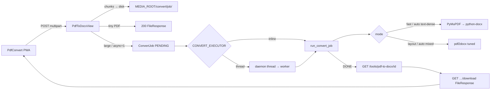

# PDF → Word Conversion

Async, offline, free/OSS conversion for Teyssir ERP (Windows Hub–optimized).

## Overview

Staff convert supplier invoices, catalogues, and school lists from PDF to editable
`.docx` without freezing the POS. The pipeline mirrors the book-scan `ScanJob` pattern:
create a job, run it in a background thread (Windows default), poll until done, then
stream the file with `FileResponse`.

## Modes

| Mode | When | Engine | Trade-off |
|------|------|--------|-----------|
| **auto** (default) | text-dense → fast, else layout | heuristic on chars/images per page | Best default |
| **fast** | invoices, reports, books with a text layer | PyMuPDF text → `python-docx` | **6–40× faster**; weak column/table layout |
| **layout** | graphic / mixed PDFs needing fidelity | pdf2docx (`stream=`, clip 2.0, lattice tables, MP if ≥8 pages) | Slower; better layout |

### Auto heuristic

A PDF is treated as text-dense when:

* pages ≤ 80
* average characters/page ≥ 80
* average images/page ≤ 1.5

## API

| Method | Path | Behaviour |
|--------|------|-----------|
| `POST` | `/api/v1/tools/pdf-to-docx` | Multipart `file` (+ optional `mode`, `async=1`). Tiny PDFs (≤2 MB, ≤5 pages) return **200** + `.docx` (backward compatible). Otherwise **202** `{job_id, status:"pending"}`. |
| `GET` | `/api/v1/tools/pdf-to-docx/<job_id>` | `pending` \| `running` \| `done` (+ `download_url`) \| `failed` (+ `error`) |
| `GET` | `/api/v1/tools/pdf-to-docx/<job_id>/download` | Streams `.docx` via `FileResponse` (no full RAM buffer) |

Auth: Token (same as the rest of `/api/v1`).

## Configuration

| Env | Default | Meaning |
|-----|---------|---------|
| `TEYSSIR_CONVERT_EXECUTOR` | `thread` on Windows, `inline` elsewhere | `inline` = sync in-request (tests); `thread` = background worker |

Workspace paths (under `MEDIA_ROOT`):

* `convert/<job_id>/in.pdf` / `out.docx` — per-job artefacts
* `tmp/` — short-lived pdf2docx scratch (not system `%TEMP%`)

## Tuning parameters (`teyssir/core/pdfconvert.py`)

| Parameter | Value | Why |
|-----------|-------|-----|
| `clip_image_res_ratio` | `2.0` (was 4.0) | Fewer pixmap pixels; large speed win on vector/image pages |
| `parse_stream_table` | `False` | Skip expensive inferred tables |
| `parse_lattice_table` | `True` | Keep ruled tables |
| `multi_processing` | on if pages ≥ 8 | Parallel page parse; needs a real file path |
| `cpu_count` | `min(4, available)` | Cap contention on the Hub |
| `MAX_PDF_BYTES` | 25 MB | Guard against huge scans |

## Benchmarks (macOS sample; Windows similar order of magnitude)

| Case | Legacy sync pdf2docx | Auto / fast | Gain |
|------|---------------------:|------------:|-----:|
| 2-page text | 0.38 s | 0.06 s | ~6× |
| 10-page mixed | 4.95 s | 0.13 s | ~39× |
| 50-page text | 6.89 s | 0.78 s | ~9× |

Reproduce: `python tools/bench_pdfconvert.py`

## Limitations

* **Scanned / image-only PDFs** have little or no text layer — fast mode yields empty or sparse Word docs; layout mode still cannot invent text (no OCR here). Use **Book OCR** (`docs/BOOK-OCR-ARCHITECTURE.md`) for camera/ISBN workflows, or run an external OCR then convert.
* Fast mode does **not** preserve complex multi-column layout or fancy tables — choose **Fidèle / layout** when that matters.
* Jobs are **local-only** (not synced till↔hub). Clean old `media/convert/*` periodically if disk is tight.

## Troubleshooting

| Symptom | Likely cause | Fix |
|---------|--------------|-----|
| UI freezes during convert | `CONVERT_EXECUTOR=inline` on Hub | Set `TEYSSIR_CONVERT_EXECUTOR=thread` in `.env`, restart |
| Slow even on text PDFs | Forced `mode=layout` | Use Auto or Rapide in the UI |
| Job stuck `pending` | Worker thread crashed / DB connection | Check logs; `GET` job for `failed` + `error`; restart Hub |
| `conversion failed` / 422 | Encrypted, corrupt, or non-PDF upload | Re-export PDF; ensure `%PDF` header |
| Defender / AV lag on Windows | Realtime scan of every temp write | Exclude `media\tmp` and `media\convert` from Defender |
| Disk filling up | Old job folders left behind | Delete aged dirs under `media/convert/` |
| Download 409 | Job not `DONE` yet | Keep polling until `status=done` |

## Related code

* `teyssir/core/models.py` — `ConvertJob`
* `teyssir/core/convert_jobs.py` — `enqueue_convert` / `run_convert_job`
* `teyssir/core/pdfconvert.py` — engines + heuristics
* `teyssir/api/views.py` — `PdfToDocxView` / `Job` / `Download`
* `frontend/src/pages/PdfConvert.jsx` — PWA UI + poll
* `teyssir/catalog/bookscan/jobs.py` — pattern this system reuses
